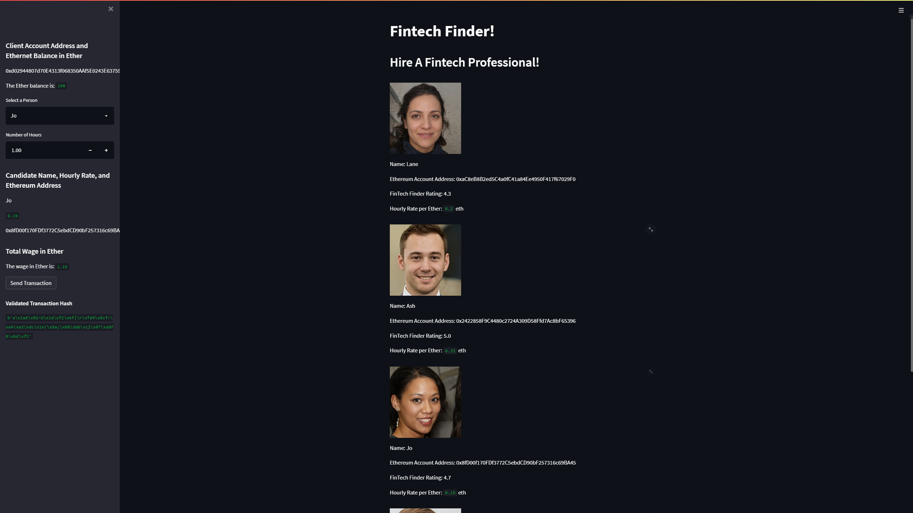
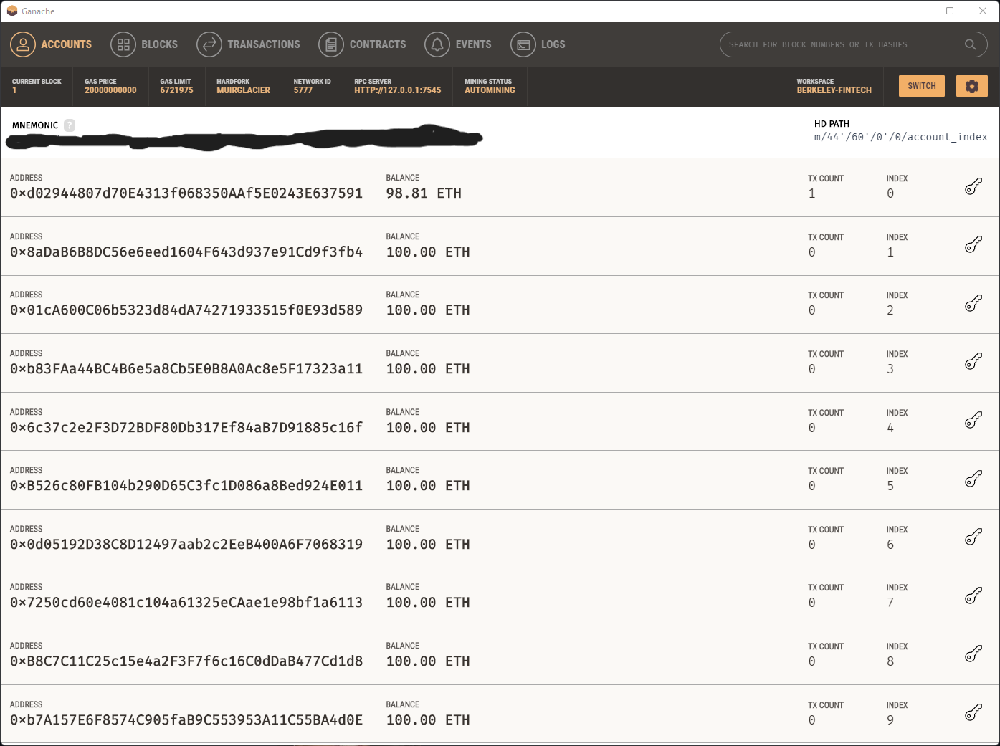
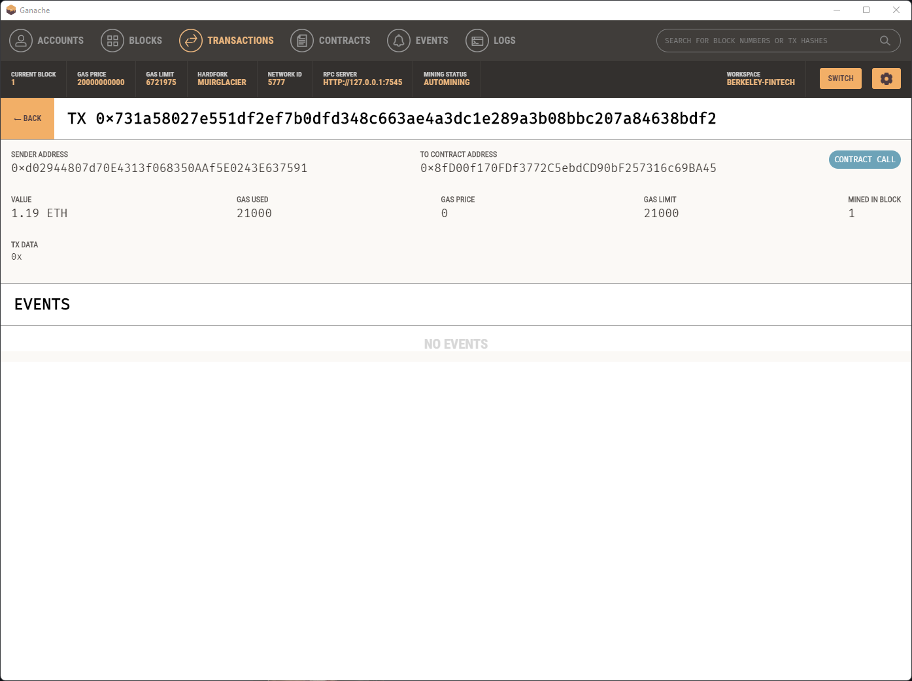

<!-- Find and Replace All [repo_name] -->
<!-- Replace [product-screenshot] [product-url] -->
<!-- Other Badgets https://naereen.github.io/badges/ -->
[![Contributors][contributors-shield]][contributors-url]
[![Forks][forks-shield]][forks-url]
[![Stargazers][stars-shield]][stars-url]
[![Issues][issues-shield]][issues-url]
[![LinkedIn][linkedin-shield]][linkedin-url]
<!-- [![License][license-shield]][license-url] -->


<!-- TABLE OF CONTENTS -->
<details open="open">
  <summary>Table of Contents</summary>
  <ol>
    <li>
      <a href="#about-the-project">About The Project</a>
      <ul>
        <li><a href="#built-with">Built With</a></li>
      </ul>
    </li>
    <li>
      <a href="#getting-started">Getting Started</a>
      <ul>
        <li><a href="#prerequisites">Prerequisites</a></li>
        <li><a href="#installation">Installation</a></li>
      </ul>
    </li>
    <li><a href="#usage">Usage</a></li>
    <li><a href="#roadmap">Roadmap</a></li>
    <li><a href="#contributing">Contributing</a></li>
	<!-- <li><a href="#license">License</a></li> -->
    <li><a href="#contact">Contact</a></li>
    <li><a href="#acknowledgements">Acknowledgements</a></li>
  </ol>
</details>

---

<!-- ABOUT THE PROJECT -->
## About The Project

This is an application that customers can use to find FinTech professionals from among a list of candidates, hire them, and pay them. It integrates the Ethereum blockchain network into the application in order to enable customers to instantly pay the FinTech professionals whom they hire with ETH.

---

### Built With

<!-- This section should list any major frameworks that you built your project using. Leave any add-ons/plugins for the acknowledgements section. Here are a few examples. -->

* [Python](https://www.python.org/)
* [Python conda](https://docs.conda.io/projects/conda/en/latest/user-guide/install/index.html)
* [Python pandas](https://pandas.pydata.org/)
* [Web3.py](https://web3py.readthedocs.io/en/stable/)
* [Python bip44](https://pypi.org/project/bip44/)
* [Streamlit](https://streamlit.io/)

---

<!-- GETTING STARTED -->
## Getting Started

<!-- This is an example of how you may give instructions on setting up your project locally. To get a local copy up and running follow these simple example steps. -->

You don't need Python directly on your system. You can install Anaconda for a virtual environment and JupyterLab normally just like any other application on your computer. Follow the instructions for Anaconda, ensure that its working, then install JupyterLab.

You will need Anaconda Navigator as the preferred tool to install the Streamlit environment.  Go to the Streamlit docs to follow the installation.

I have placed Comments throughout the code so that you can follow the Lambda code and be able to replicate the app on your own. Also, so that you're able to contribute in the future :-)

---

### Prerequisites

<!-- This is an example of how to list things you need to use the software and how to install them. -->
A text editor such as [VS Code](https://code.visualstudio.com/) or [Sublime Text](https://www.sublimetext.com/)

### Installation

1. Clone the repo
   ```sh
   git clone https://github.com/AnaIitico/Fintech_Finder.git
   ```

2. You don't need to install pip - Conda comes with pip and you can also use the command
    conda install 'package name'
   
3. Install Conda according to the instructions based on your operating system.
    For windows users you MUST use the Administrator PowerShell. Users with AMD Processors MUST use the Administrator PowerShell 7 (X64) version
  
    Once installed Conda has an Admin PowerShell version shortcut - look on your Start menu for it.
    This shortcut will prove very useful at times when you need to install other apps or make adjustments to your installation

    Once installed and you have finished all Conda instructions, you will see (base) on your terminal.  Make sure that you finish the Conda full installation or this will not work!!
   
4. Activate Conda Dev environment
   ```sh
   conda activate dev
   ```
    You should now see (dev) on your terminal (if not go back to step 3)

5. Install Streamlit from the Anaconda Navigator
   ```sh
   pip install streamlit
   ```

6. Conda install Web3.py to avoid dependency conflicts
   ```sh
   conda install -c conda-forge web3
   ```

7. Install bip44
   ```sh
   pip install bip44
   ```

8. Update conda environment - run each command one at a time
   ```sh
   conda deactivate dev
   ```

   ```sh
   conda update conda
   ```

   ```sh
   conda update Anaconda
   ```

   ```sh
   conda activate dev
   ```

---

<!-- USAGE EXAMPLES -->
## Usage
  
<!-- Use this space to show useful examples of how a project can be used. Additional screenshots, code examples and demos work well in this space. You may also link to more resources. -->

#### This image shows the App live on Streamlit
  - Select the FinTech professional
  - Select the number of hours
  - Review the fee based on hours and Ethereum price
  - Send transaction to blockchain
  - Verify the hash



---

#### This image shows the Ganache account balance State after the transaction
  - Number of transactions is visible
  - Wallet Address is confirmed



---

#### This image shows the Ganache transaction hash and information
  - Sender and Receiver address are visible and confirmed
  - Transaction hash is visible and confirmed
  - ETH value is confirmed



---

<!-- ROADMAP -->

## Roadmap

  The app is finished
<!-- Here are some screenshots and code snippets of the working app

#### Exchange Comparison January 2018
![Exchange January Screen Shot][exchange-january-screenshot]

#### Exchange Comparison March 2018 - With Analysis
![Exchange March Screen Shot][exchange-march-screenshot]


#### Calculate Arbitrage Profits Snippet - for January 16 only
#### you can see the full code (with outputs) in the [crypto_arbitrage.ipynb](https://github.com/AnaIitico/Fintech_Finder/blob/main/Fintech_Finder.ipynb) file
  *This code has been summarized into one block for convenience*
  *and there's an analysis at the end*
```sh
  # some cool code here
 ``` -->

See the [open issues](https://github.com/AnaIitico/Fintech_Finder/issues) for a list of proposed features (and known issues).

---

<!-- CONTRIBUTING -->
## Contributing

Contributions are what make the open source community such an amazing place to be learn, inspire, and create. Any contributions you make are **greatly appreciated**.

1. Fork the Project
2. Create your Feature Branch (`git checkout -b feature/AmazingFeature`)
3. Commit your Changes (`git commit -m 'Add some AmazingFeature'`)
4. Push to the Branch (`git push origin feature/AmazingFeature`)
5. Open a Pull Request

<!-- CONTACT -->
## Contact

Jose Tollinchi - [@josetollinchi][linkedin-url] - jtollinchi1971@gmail.com

Project Link: [https://github.com/AnaIitico/Fintech_Finder](https://github.com/AnaIitico/Fintech_Finder)

---

<!-- ACKNOWLEDGEMENTS -->
## Acknowledgements

<!-- Other Dependencies used to build the project.
##### Search google for the correct conda install command -->

* [Img Shields](https://shields.io)
* [Choose an Open Source License](https://choosealicense.com)

<!-- MARKDOWN LINKS & IMAGES -->
<!-- https://www.markdownguide.org/basic-syntax/#reference-style-links -->
[contributors-shield]: https://img.shields.io/github/contributors/AnaIitico/Fintech_Finder.svg?style=for-the-badge
[contributors-url]: https://github.com/AnaIitico/Fintech_Finder/graphs/contributors
[forks-shield]: https://img.shields.io/github/forks/AnaIitico/Fintech_Finder.svg?style=for-the-badge
[forks-url]: https://github.com/AnaIitico/Fintech_Finder/network/members
[stars-shield]: https://img.shields.io/github/stars/AnaIitico/Fintech_Finder.svg?style=for-the-badge
[stars-url]: https://github.com/AnaIitico/Fintech_Finder/stargazers
[issues-shield]: https://img.shields.io/github/issues/AnaIitico/Fintech_Finder/network/members?style=for-the-badge
[issues-url]: https://github.com/AnaIitico/Fintech_Finder/issues
<!-- [license-shield]: 
[license-url]:  -->
[linkedin-shield]: https://img.shields.io/badge/-LinkedIn-black.svg?style=for-the-badge&logo=linkedin&colorB=555
[linkedin-url]: https://www.linkedin.com/in/josetollinchi/

---

## License

[](https://opensource.org/licenses/MIT)